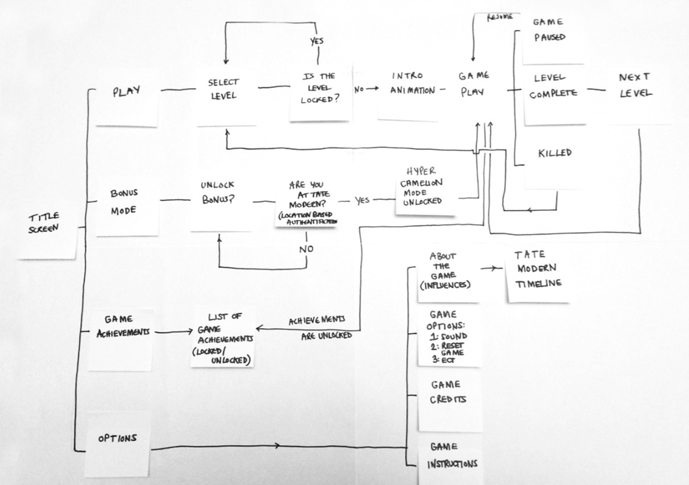
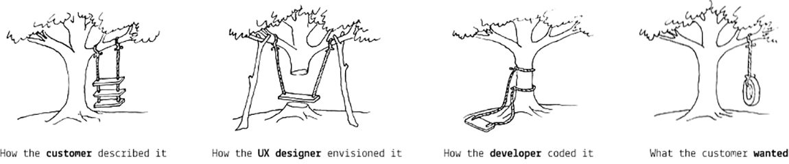

# Rapid Prototyping

1. Welcome
2. What will you learn?
3. What is User eXperience?
4. What is the problem you are trying to address?
5. How do I generate ideas?
6. User personas
7. The elevator pitch
8. Why prototyping?
9. Wireframes and concept videos
10. User testing
11. Conclusion

# What will you learn?

* **User eXperience** (UX) design principles and patterns  
* Qualitative and quantitative **user research**
* **Competitor analysis**
* User **personas**, user **stories** and user **journey maps**
* **Interface design**: **paper-prototyping** and **wireframing**
* **Rapid prototyping** tools
* **User-testing**: face2face, A/B testing and analytics
* Motivational **copy-writing** for stickiness

### Learning goals

By the end of this course, you will be able to:

1. Understand the difference between *qualitative* and *quantitative* **user research** and be familiar with a few techniques to perform both types of research.
* Research and analyse **competitor services** to gain inspiration and insight from them.
* Identify and use **design patterns** effectively in your projects.
* Produce user **personas**, user **stories** and user **journey maps** to communicate and validate your design decisions.
* Understand the importance of motivational **copy-writing** in interface design, and write interface copy that is appropriate for your audience and their task(s) at hand.
* Use **paper-prototyping** and **wireframing** techniques to visualise your interface design ideas and explore alternative solutions.
* Use **rapid prototyping** tools to quickly test solutions to specific UX problems.
* Understand the differences between various **user-testing** methods and practice them at a basic level.
* **Document** your design and development process, from the exploration of ideas to their practical implementation. Including *successes* and *failures*.
* **Communicate** your ideas both technically and in an engaging way.

# What is UX?

There are many ways of understanding **User eXperience**.

### Your turn

Read [these UX definitions](http://www.allaboutux.org/ux-definitions) and pick your favourite one, or jot down your own definition / interpretation of UX, as you currently understand it. Later you will submit this as a part of your learning log.

# How does one design user experiences?

It usually starts with the **spark of an idea**.

It could come out of frustration using a product / system that doesn't satisfy you, it could be a random intuition that hits you while you're having a shower, it could be a commissioned request from a client...

Once you have a spark, what do you do?

### All ideas are *assumptions* that need to be tested

The UX design method we will practice is about creating **small-scale experiments** and **validating** them as quickly as possible, in loops.

Key words:

* **Iteration** = repeat the design-prototype-test loop (not just once)
* **Validation** = experiments inform your design choices (keep it, tweak it or scrap it)

Aka the **build+measure+learn** approach popularised by the [Lean Startup](http://theleanstartup.com/).

# The first experiment

Before you design a **solution**, it may be sensible to test if people have the **problem** you're trying to solve.

In other words, you want to observe and understand how people are currently tackling the problem you're trying to solve.

The biggest experts about your problem are the people you’re designing for.

Every project starts from **research**, aka the *discovery* phase.

Your first experiment will be **customer discovery interviews**.

### What makes a good interview?

Imagine you have an *idea*. You call your mum, explain the idea and then ask her what she thinks. What will she say?

As pleasing as it may be to hear your mum praising your idea, it doesn't give you any real insight into the idea's value. Will actual customers want it or buy it?

The [Mom Test book](http://momtestbook.com) by [Rob Fitzpatrick](https://twitter.com/robfitz) argues that often people lie to us. Not because they're evil, but because they want to be nice to you. So the challenge for you is: when talking to (potential) customers, **how do you ask them questions that lead to truthful, insightful answers?**

#### Good or bad question?

1. Would you like an app to tell you where to go on holiday based on your budget?

	- [ ] Good question
	- [ ] Bad question

 Bad question because it’s solution-oriented, closed (could be answered with a simple yes or no) and leading. You are leading people into an answer, implying that they may want a solution around budgeting holidays.

* Do you have a problem choosing where to go on holiday?

	- [ ] Good question
	- [ ] Bad question

	Better but still a bad question. It’s closed (could be answered with a simple yes or no) and leading. You are implying that people may have a problem when choosing where to go on holiday (they may not have a problem, or the problem may be elsewhere in the process).

* Talk me through how you booked your last holiday.

	- [ ] Good question
	- [ ] Bad question

This is a good question, because it’s open and unbiased. It may take you three seconds to ask, and several minutes for people to answer. Through that, you may uncover problems you had not thought of before. Also, people are better at remembering what happened recently  (your last holiday) than reflecting on more abstract topics or imagine the future.

#### Don’t talk about your idea.

#### Do let people talk about their experience and problems.

Customer discovery interviews are not about you, they are about your customers.

* Ask **open questions** that prompt them to tell *their* story and talk about *their* problems.
* Talk about **facts in the past**, not ideas for the future.
* Talk less, **listen** more.
* Work in pairs and **take notes**.
* Focus on **interactions, pains & gains**.

After the interviews, consider:

* What were the most successful questions? Why did they work?
* How could you rephrase the less successful ones to get better answers?
* Have you thought of follow-up questions?

# Ideation

### How do I generate ideas?

If you want to have **good ideas** you must [have **many ideas**](https://medium.com/founder-stories/9bd554bedce0).

**Most** of them will not be *good*. Even bad ideas can be useful to spark good ones. See the [McDonald's theory](https://medium.com/@ienjoy/mcdonalds-theory-9216e1c9da7d).

> We’ve broken the ice with the worst possible idea, and now that the discussion has started, people suddenly get very creative. I call it the *McDonald’s Theory*: people are inspired to come up with good ideas to ward off bad ones.

### Your turn

* Write down as many ideas as possible
* There is no such thing as a  *bad* idea
* Put stray ideas to one side
* Don’t stay too long on one idea
* Avoid multi-tasking (can you put your phone away for 30 minutes?)

Capture your ideas (documents, photos of sketches etc.) and share as a part of your learning log.

# Elevator pitch

### What are the next steps?

You would think it's time to wireframe. Not quite!

First we need to define:

1. **What** is your idea?
* **Who** is it for?
* **Why** is it needed or wanted?

# Concept one-pager

A one page document summarising your idea visually, so that you can talk about it to *anyone*.

It typically includes:

* a catchy title
* a strapline
* answers to your elevator pitch
* a visualisation of the idea (but not necessarily wireframes or mockups)

SHOW SOME EXAMPLES HERE

### Your turn

Individually, sketch out a concept one-pager and afterwards share it as a part of your learning log.

### Experience map on post-its

Once you have a concept, and before you dive into the details of it, it's very useful to map out the **customer journey** (aka *experience map*).

You can do that with **post-its first** (and optionally turn your map digital, if it needs many iterations).

1. **List** out each fundamental **step** in your experience.   

	A step could eventually become many screens, but in a customer journey map it can be condensed into one step.  

	Don't worry about interface for now. Focus on the **purpose** of each step.
* **Connect** the steps in a map.

# Prototyping

### Why prototyping?

In an **iterative** UX design process, prototyping allows you to **quickly mock up** the *future state* of a system and **test** it with users, team mates and clients.

Doing this **rapidly and iteratively** generates feedback early and often in the process, improving the final design and reducing the need for costly changes during development.

* A prototype **answers questions**. The more specific the better.

* A prototype stands between your **assumptions** and your users **behaviours**.

* A prototype should be **quick** (and cheap) to make, re-make and possibly discard.

* A prototype should be **close** to the real thing...

* ... but a prototype is **not the real thing**.

### Which prototyping tool should I use?

Start with paper, then go digital!

Each prototyping tool has its own feature set and strengths. Based on your needs and the requirements of your project, evaluate which tool is more appropriate:

1. How **easy** is it to learn and use the tool?
* Are there collections of **reusable templates** or widgets available?
* How easy is it to make changes on the fly or to **incorporate feedback**?
* Does it have any **collaboration features**, such as allowing multiple people to work on it at the same time?
* What are the licensing terms and **costs**?

#### Tools to consider

Name | Platform | Free?
---- | -------- | -----
[Moqups](https://moqups.com) | Web-based | Freemium
[Invision](http://www.invisionapp.com/) | Web-based | Yes
[Adobe Experience Design](http://www.adobe.com/uk/products/experience-design.html) | Mac and Win | In preview (they may charge you later)
[Sketch](http://www.bohemiancoding.com/sketch/) | Mac only | Free trial, then $49 (education price)
[Justinmind](http://www.justinmind.com) | Mac and Win | 30-days free trial, then $19/month
[Balsamiq](https://balsamiq.com/products/mockups) | Mac and Win | 30-days free trial, then $89
[Framer](http://framerjs.com) | Mac only | 30-days free trial, then $99
[Atomic](https://atomic.io) | Web-based | 30-days free trial
[UXPin](https://www.uxpin.com) | Web-based | 7-days free trial

### User personas

#### Why personas?

Whenever we design for a group of users that are not ourselves (which means, always) we make assumptions about their behaviours, goals and needs, attitudes, skills etc.  

A common tool to *get to know your assumptions* about a group of user is creating a user persona.

[Alan Cooper introduced user personas](http://www.cooper.com/journal/2008/05/the_origin_of_personas) as a methodology to solve the **elastic user** problem. As designers, we are tempted to stretch the user to fit almost perfectly to whatever you are designing. The vagueness of the user causes many design failures, because the user is too elastic. We therefore need something much more specific.

A user persona allows you to visualise users with **common behavioural patterns** in their purchasing decisions, use of technology or products, customer service preferences, lifestyle choices, etc.

#### What dimensions are used to cluster users into a persona?

1. **Behaviours**: what users do
2. **Attitudes**: what users expect
3. **Motivations**: what users want / need
4. **Limitations**: what blocks them from doing what they want / need

**Demographics** are not really that useful.

#### Your turn

Create (at least) two user personas for your interactive exhibit.

Base your personas on the people you have interviewed (eg: this persona is based on four people we interviewed, and they all stated X and Y).

If you desperately need a template, you could [use this as a starting point](http://www.ux-lady.com/diy-user-personas/) but don't just mindlessly copy it. Think of what **dimensions** will be useful in the design process.

Please no gimmicky graphs, unless they're based on research data and tell us something useful about the cluster of people they describe. Remember to capture it and submit it as a part of your learning log.

# Where does it hurt?

Imagine you're a person (or a *persona*) going through your experience map.

1. Define a **goal** for your person(a). What does s/he want to achieve through the experience?

	In other words, what is the *destination* s/he wants to reach in your experience map?
* Simulate the **experience flow**: go through each step with your team and discuss what happens to your person(a).
* For each step, identify potential **pain points**.  

	Add emoticons to each step, to visualise what's happening inside your person(a)'s head.

	

### The riskiest assumption

Going through the *experience flow* and identifying its *pain points* will allow you to uncover the **riskiest assumptions** in your idea.

An assumption is a prediction for what you think will happen. Will users really behave as you predicted in your experience map?

Your riskiest assumption is both **core** to your idea and **most unknown**, meaning you have little data to prove it's valid. It's important to always test your **riskiest assumption first**.

### Prototyping (to experiment)

Prototype, either on paper or digitally (or both, if your experience requires physical supports) the part of your experience where the riskiest assumption lies.

(Here's a [great video-example of paper Prototyping](https://www.youtube.com/watch?v=_g4GGtJ8NCY).

A few tips:

* Use **realistic content**.

	As designers we're good at spotting *placeholder* text or images, however not everyone is familiar with them and sometimes people get hung up on details or ask `Why is that text in a foreign language?` (lorem ipsum).  

	Avoid *lorem ipsum* and stock photos like the plague!

	You can find [real maps from the NMM collection here](https://docs.google.com/presentation/d/1tEg72Z_1cyxSUN1VfkW8Oke9gOZtmok0DRQ3odi61_4/edit?usp=sharing).

* How good is **good enough**?

	You want to strike a balance between the time it takes to build the prototype, and how close to the real thing you need it to be for your user-testing to be effective.

	 When user-testing, it's crucial that you explain to people that this is **not a finished product** (even though it looks obvious to you) and that you are not testing colours, animations etc.

* Avoid **linear click-throughs**.

	Even if there's one single call to action per screen, your prototype should offer a couple of options to users.

* Create **reusable** styles and symbols.

	There are ways to do it in every prototyping tool.

	If you catch yourself building the same button twice, that's an alarm bell: you should turn it into a *symbol* (or *smart object*, or whatever your tool of choice calls them).

*	Use **real devices** when testing.

	If you're designing a mobile app, get the prototype on your mobile. If you're designing a touchscreen experience, get the prototype on a tablet.
