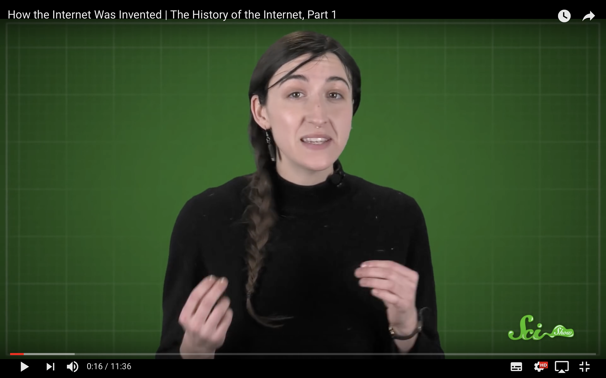

## Before class

> `Watch this and pay attention because we will have a quiz in class. Bring in an item which symbols connectivity to you and explain why it does in the first lesson`

## During this course you will learn how to:
* Learn about the history of the web
* Investigate and apply visual perceptions to your project
* Set a Wordpress site and populate it with content

In particular, you will:

* Get familiar with **protocols**, **colour theory**, **typography**, **HTML** and **CSS**
* Research and use Wordpress themes and integrate them in your project
* Develop your **computational thinking** skills with coding challenges
* Analyse the thinking behind colour theory and typography to fit with your user personas
* Create proof-of-concept functional **website** and populate the site with bespoke content
* Work in **teams**, learning from your peers and teaching them what you learned
* **Document** your work regularly and reflect on your creative process
* **Communicate** your ideas both technically and in an engaging way

The World Wide Web continues to provide a foundation for the development of a broad range of increasingly influential and strategic technologies, supporting a large variety of consumer applications and services. Apprentices need to develop an understanding of how web technologies are used and applied for digital media and IP TV solutions.

## Plan

When | In class           | Homework
---- | ------------------ | --------
[Monday 08.01](sessions/01)| <ul><li>Welcome <li>Quiz time! <li>Introduction to brief <li>The History of the Web <li>Open Source | [Watch part 2 of the History of the web](https://www.youtube.com/watch?v=1CsPHKJWiw0)
[Tuesday 09.01](sessions/02)| <ul><li>Quiz time! <li>Visual Perceptions <li>User Personas <li>Content before you code  | [Watch part 3 of the History of the web](https://www.youtube.com/watch?v=eYkXD_cGUYU)
[Wednesday 10.01](sessions/03)| <ul><li>Quiz time! <li>HTML & CSS <li>Introduction to Wordpress | [Watch this film on graphic design fundamentals theory](https://www.youtube.com/watch?v=YqQx75OPRa0)
[Thursday 11.01](sessions/04)| <ul><li>Build your website <li>Tutorials | <ul><li> [Watch this film on colour theory](https://www.youtube.com/watch?v=_2LLXnUdUIc) <li> [Watch this film on typography](https://www.youtube.com/watch?v=sByzHoiYFX0)
[Friday 12.01](sessions/05)| <ul><li>Finish website <li>Tutorials |

### Project

For this project you are meant to work in teams and together collaborate on making a website with Wordpress. Each team will be allocated a topic, for which they will investigate. After the research is completed you will create bespoke content and branding material for the website.

Each team member should be allocated a role and a part of the website that they will focus on.

### Potential roles are:
* Team leader
* Branding manager
* Art director
* Content manager
* Social Media Manager
* Video producer

These are just some examples and you might come up with your own.

### You are expected to deliver:
* A research pack which justifies the design choices you have made. This research pack should include: user personas, content map, market research, mood boards, wireframes, logo examples and typography examples.
* A fully working website with bespoke content.
* Brand guidelines

## Learning goals

* To understand the principles, structures, development and management of web sites
* Develop a working knowledge of client and server-side technologies, standards and protocols
* Understand the role and requirements of hardware and infrastructure (such as servers and load-balancing requirements)
* Demonstrate proficiency in using web tools for problem solving, and in the testing, troubleshooting and de-bugging of digital media solutions.

## Rules of the road

* **Be present**. If you happen to be late or absent, make sure you email me about it before a session starts.
* **Participate** in class debates and workshops. We'll make sure that your ideas have space to be heard and that nobody makes you feel uncomfortable about sharing them.
* **Present** your work during formative and summative assessments. If you can't make it those days then you'll record your presentation and upload it to YouTube (or similar).
* **Be responsible** for what happens in class. Organise with your peers to get class information and material that you may have missed.
* **Meet the deadlines**. If you submit your work after a deadline, your grade will be capped at D- (bare pass).

### License

This work is licensed under a [Creative Commons Attribution-NonCommercial-ShareAlike 4.0 International License ](http://creativecommons.org/licenses/by-nc-sa/4.0)
