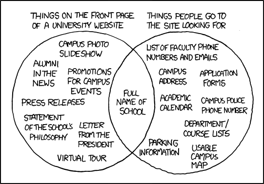

# Rapid Prototyping

1. Welcome
2. What will you learn?
3. What is User eXperience?
4. What is the problem you are trying to address?
5. How do I generate ideas?
6. User personas
7. The elevator pitch
8. Why prototyping?
9. Wireframes and concept videos
10. User testing
11. Conclusion

# What will you learn?

* **User eXperience** (UX) design principles and patterns  
* Qualitative and quantitative **user research**
* **Competitor analysis**
* User **personas**, user **stories** and user **journey maps**
* **Interface design**: **paper-prototyping** and **wireframing**
* **Rapid prototyping** tools
* **User-testing**: face2face, A/B testing and analytics
* Motivational **copy-writing** for stickiness

### Learning goals

# Learning goals

By the end of this course, you will be able to:

1. Understand the difference between *qualitative* and *quantitative* **user research** and be familiar with a few techniques to perform both types of research.
* Research and analyse **competitor services** to gain inspiration and insight from them.
* Identify and use **design patterns** effectively in your projects.
* Produce user **personas**, user **stories** and user **journey maps** to communicate and validate your design decisions.
* Understand the importance of motivational **copy-writing** in interface design, and write interface copy that is appropriate for your audience and their task(s) at hand.
* Use **paper-prototyping** and **wireframing** techniques to visualise your interface design ideas and explore alternative solutions.
* Use **rapid prototyping** tools to quickly test solutions to specific UX problems.
* Understand the differences between various **user-testing** methods and practice them at a basic level.
* **Document** your design and development process, from the exploration of ideas to their practical implementation. Including *successes* and *failures*.
* **Communicate** your ideas both technically and in an engaging way.

