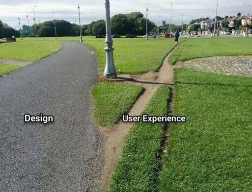

# Rapid Prototyping

1. Welcome
2. What will you learn?
3. What is User eXperience?
4. What is the problem you are trying to address?
5. How do I generate ideas?
6. User personas
7. The elevator pitch
8. Why prototyping?
9. Wireframes and concept videos
10. User testing

