# Lecture 1 

**Date:** Friday 3rd Feb

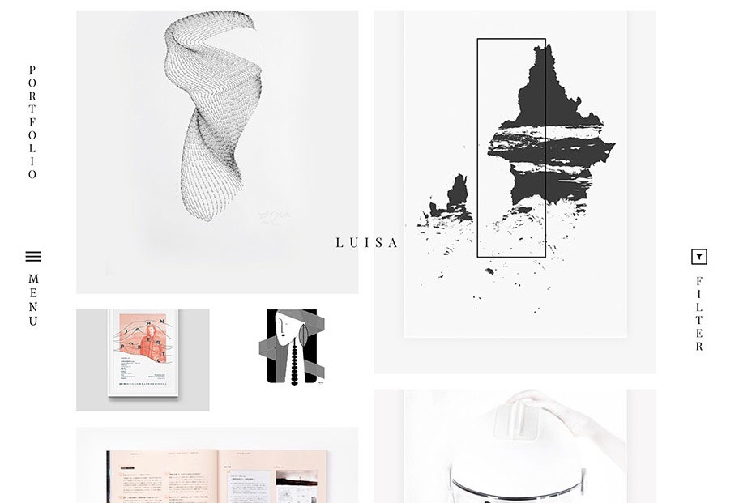

### Before you arrive 

1. Think about what you want your site to be called
2. Register a domain name or bring a credit card (godaddy.com is cheap and straight forward) 
3. Prepare some work so we can discuss the curation 


.coms are more expensive than .co.uk ­ but still only £10 per year or so. However, there is no difference in terms of ‘weight'.

### In class we will discuss: 

1. The different platforms and off­the­shelf web creation tools
2. Do you want your site to be more findable and image­led (like instagram) or more of a portfolio site with editorial copy?
3. How often will you update your site? Monthly? Weekly? Do you create digital content as you work at the moment?
4. Workshop / start building your content / branding  

## Platforms

### [Squarespace](https://www.squarespace.com)
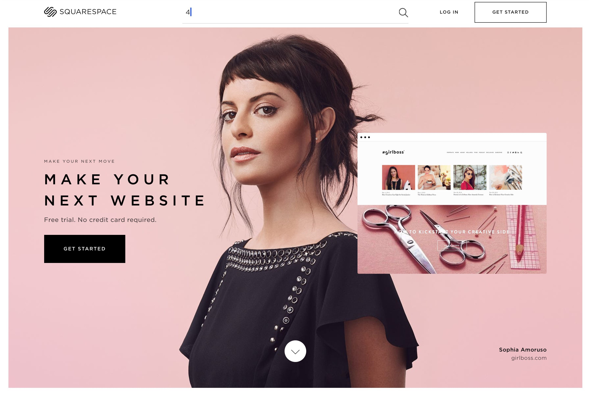

You can find themes [for Squarespace here](https://www.squarespace.com/templates/)
	
### [Wix](https://www.wix.com)
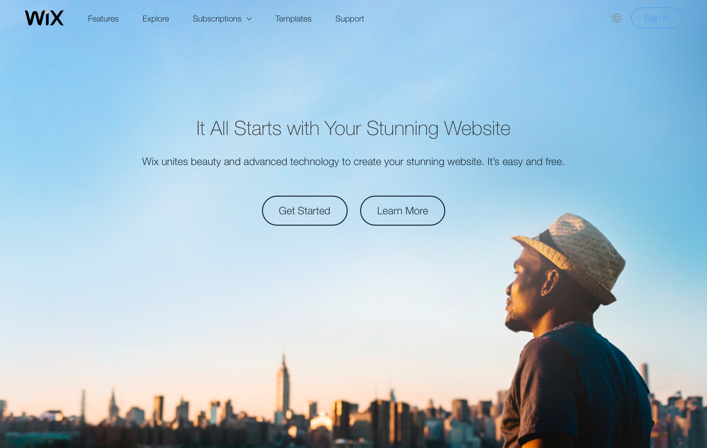

You can find themes [for Wix here](http://www.wix.com/website/templates)

### [Wordpress](https://www.wordpress.com)
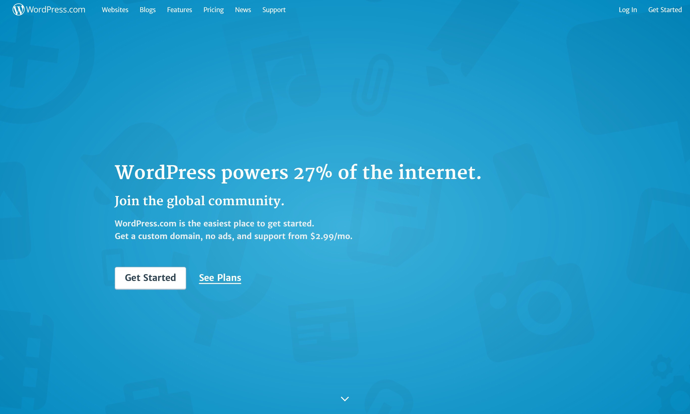

You can find themes [for Wordpress here](https://theme.wordpress.com)

If you are adventurous you can install wordpress yourself on your hosting and have more control. (This is next level)

### [Blogger](https://www.blogger.com)



## Social Media
Are you on Twitter? Instagram? FB? We’ll discuss linking to your social channels

### The sweeet spot of social media

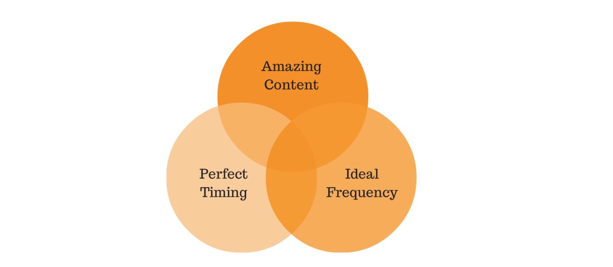

### Add images! 

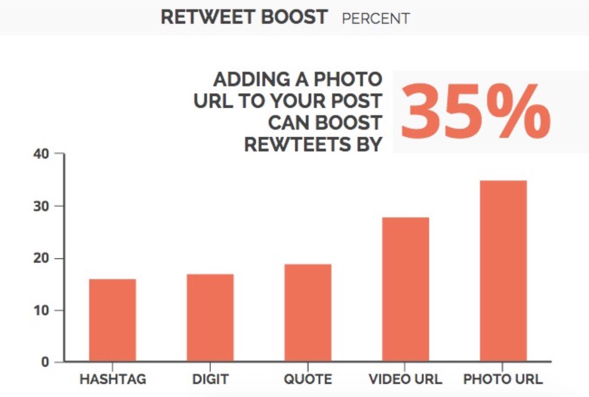

### How often?

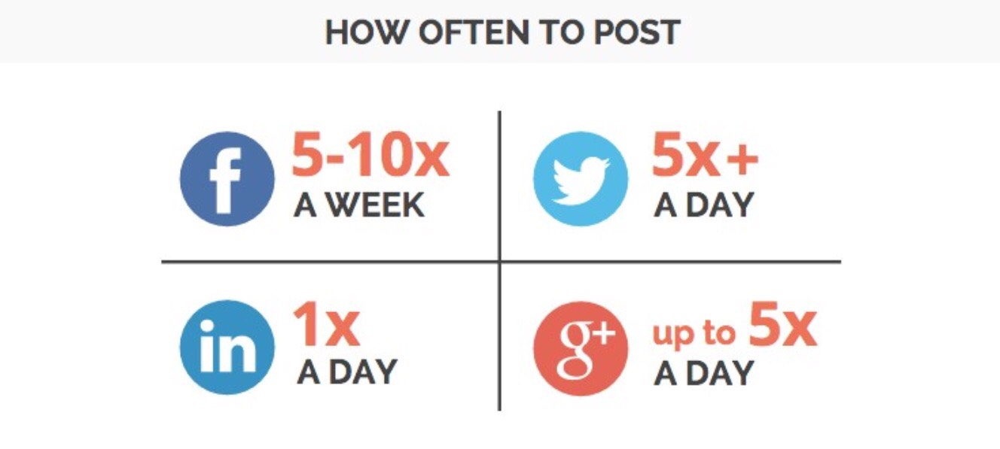

### What times are optimal?

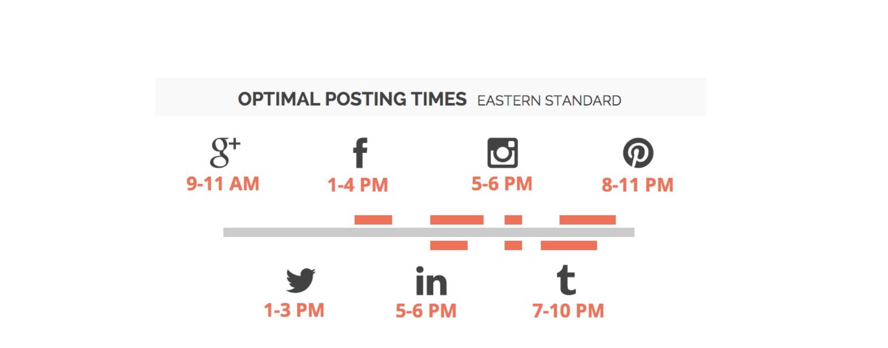

## Examples

http://ludmillamaury.com

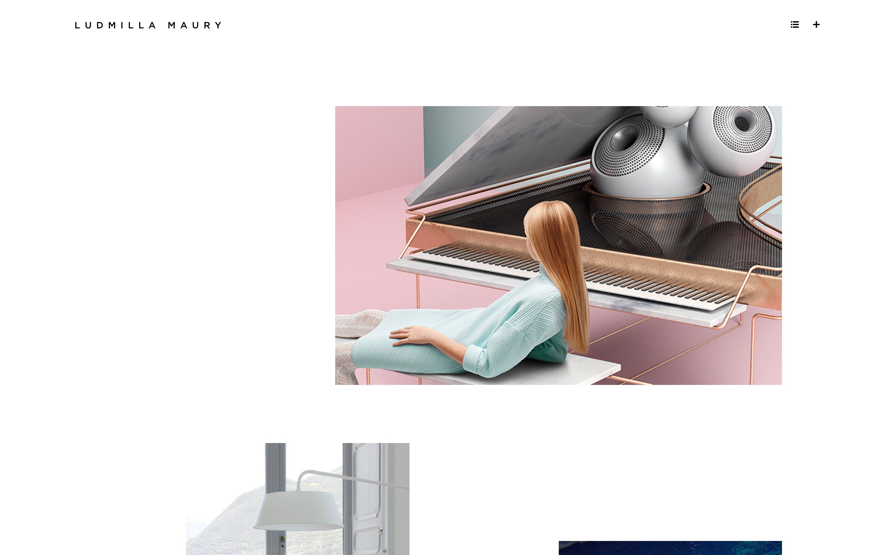

http://www.blackballoon.fr

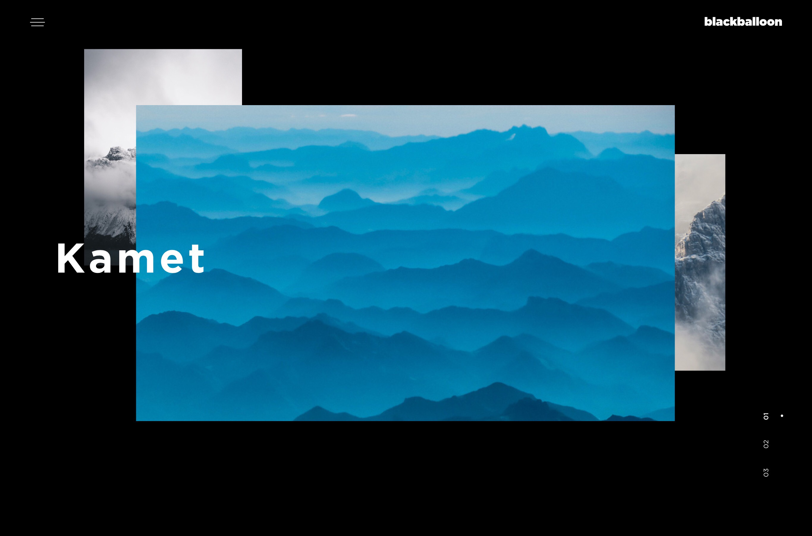

http://jamesjoyce.co.uk

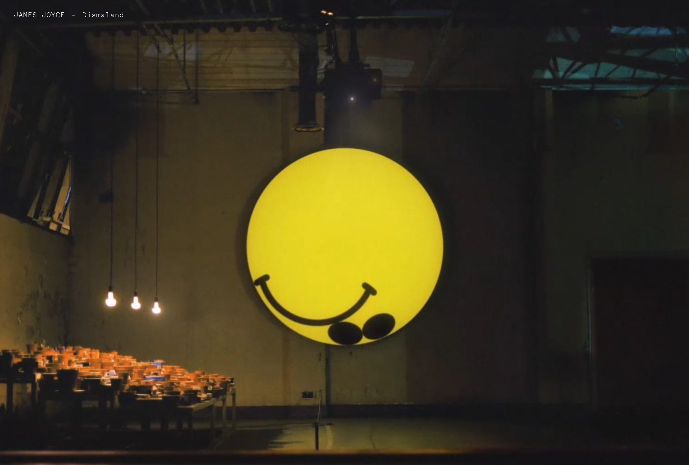

http://www.mondieu.nu

## Typography

1. How do people read?
2. Fonts: serif, sans-serif etc, weights and styles
3. The personality of fonts: expressive typography
4. Web design 95% typography

[19 best free fonts of 2017](http://www.digitalartsonline.co.uk/features/typography/19-best-free-fonts-of-2017/)

### Sans font

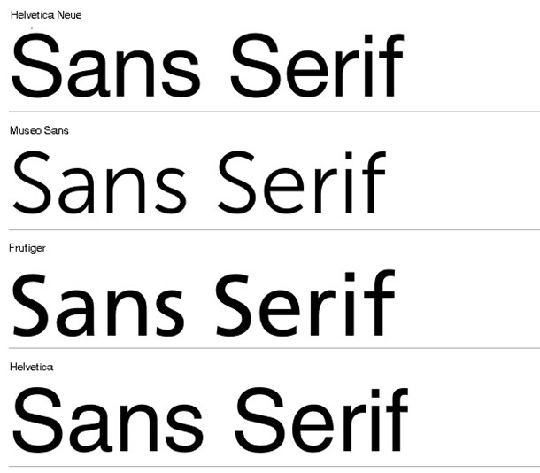

### Sans-serif font

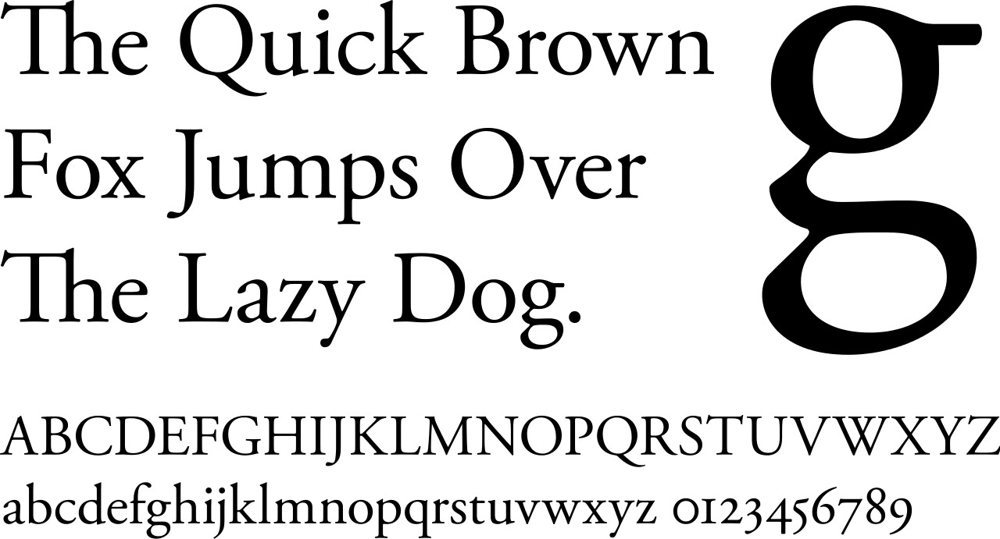

## Colors 

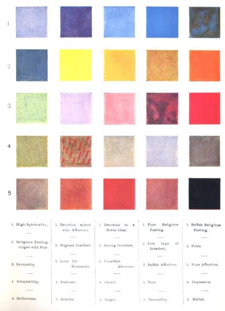

[Color swatch generator](https://coolors.co)

# Workshop 

1. Choose a website builder (if you have not already)
2. Buy your domain (if you have not already)
3. Sketch/wireframe/consider what should be on each of your pages (Home, Portfolio, Bio and Contact) 
4. Start uploading content and lets discuss it

## Deliverables for formative

1. Purchase a domain and assign it to your website via a web builder
2. Draft a minimum of 4 pages which include: Home page, Portfolio, Designer Bio and Contact page
3. Your Designer Bio page should have a minimum of 500 words and a photograph of yourself or an image that represents you.