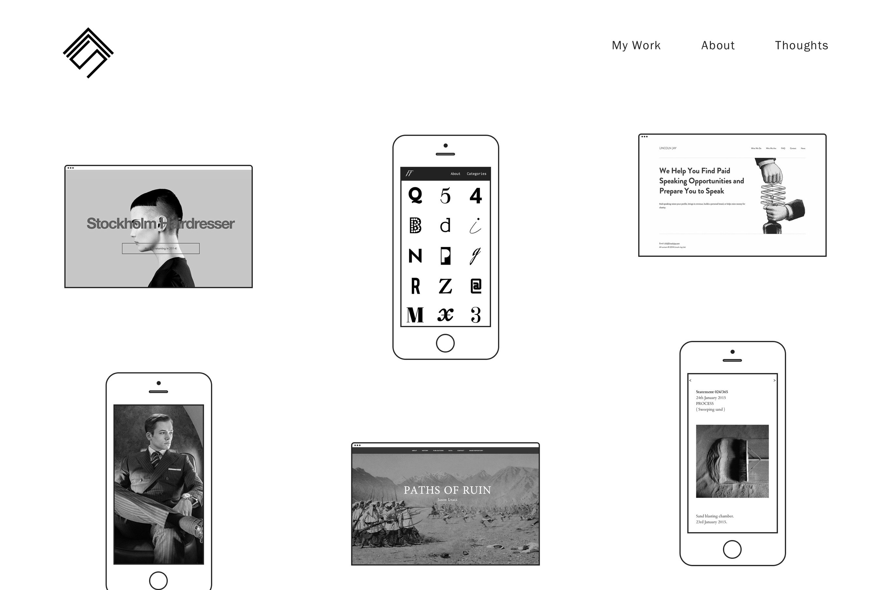
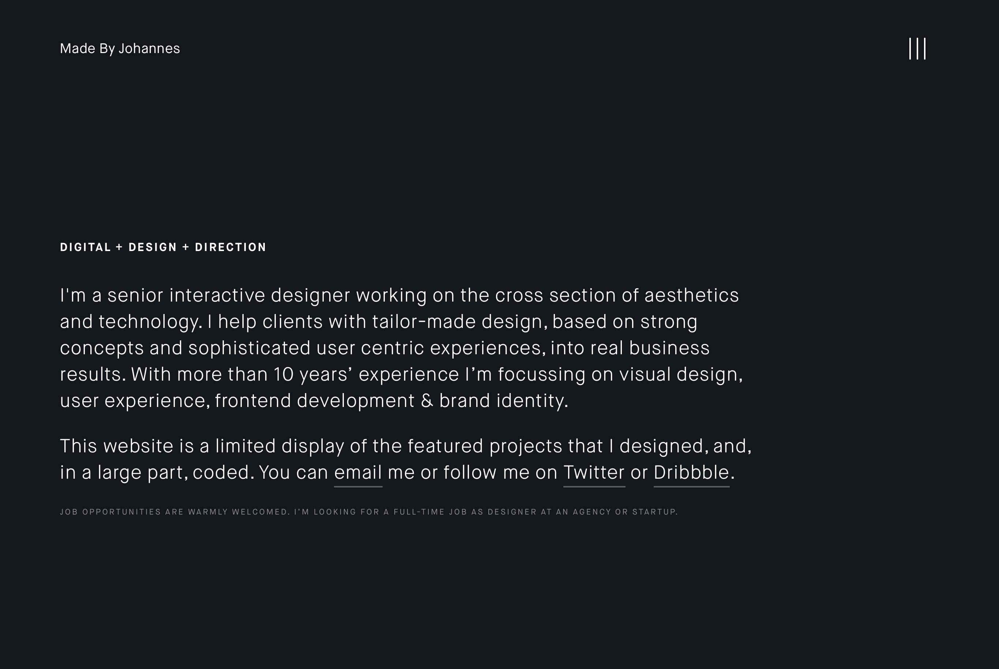
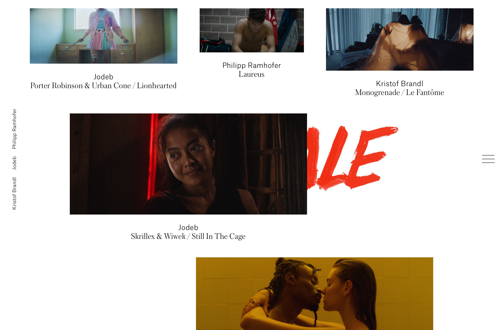
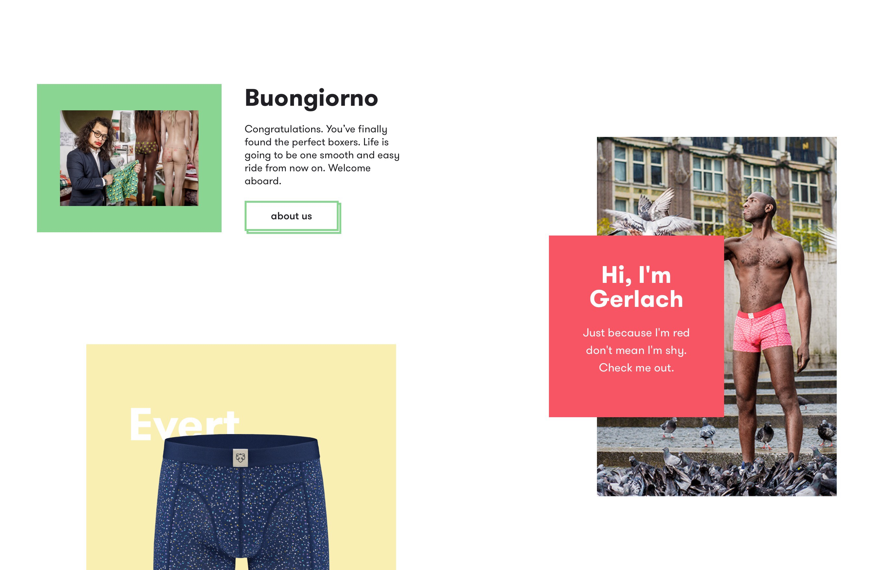
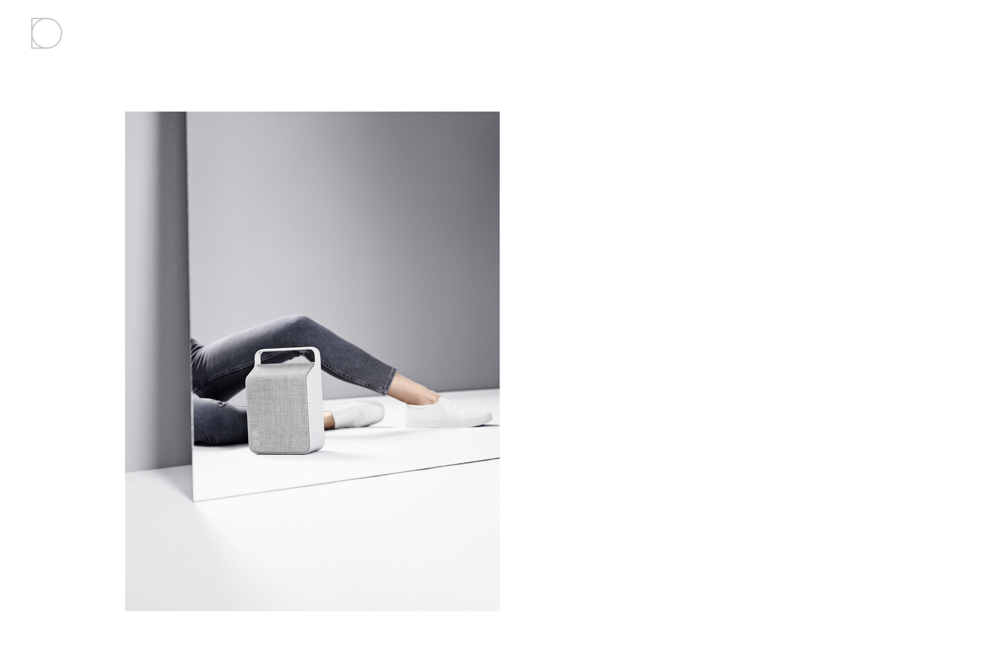
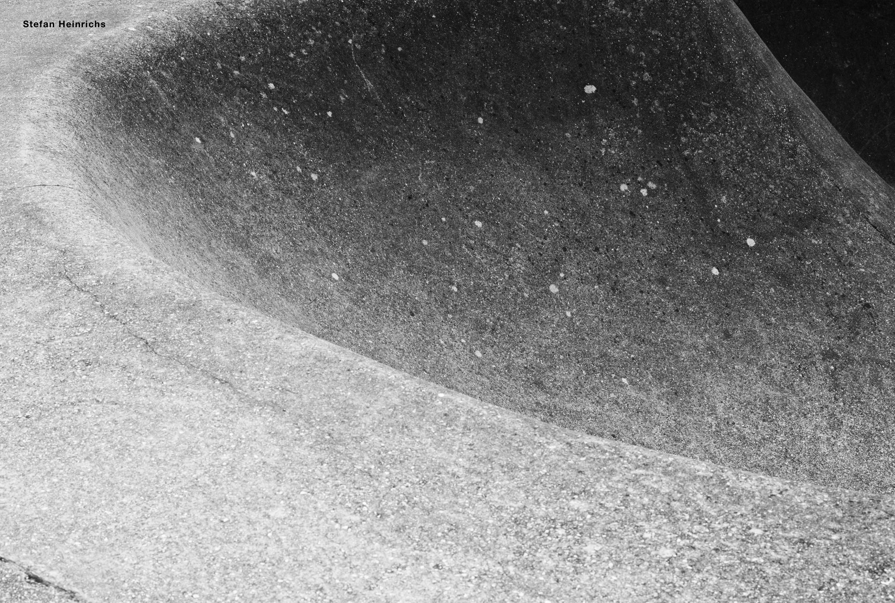
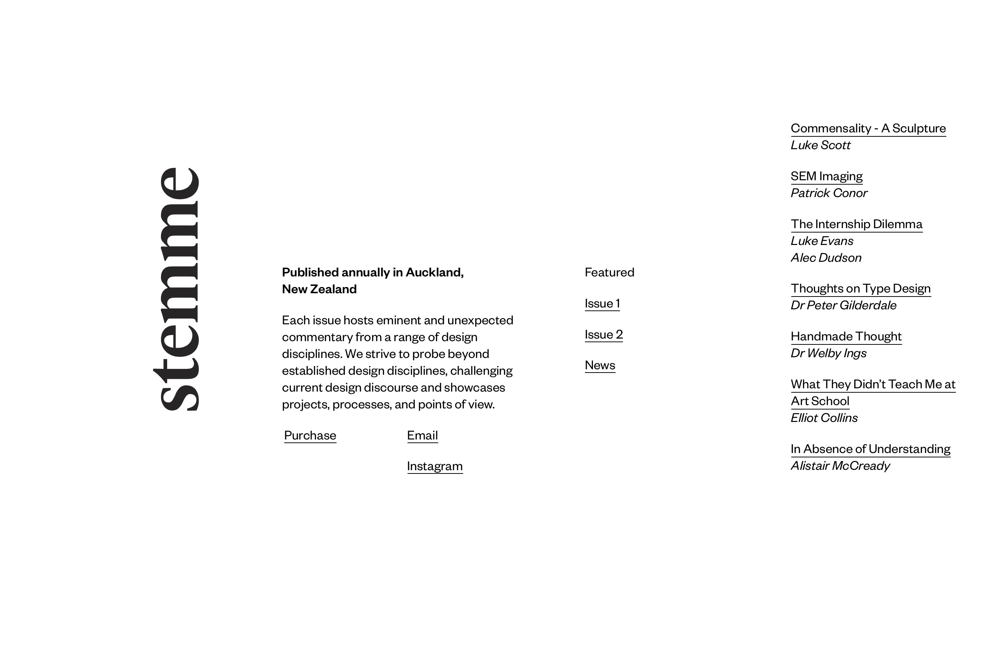
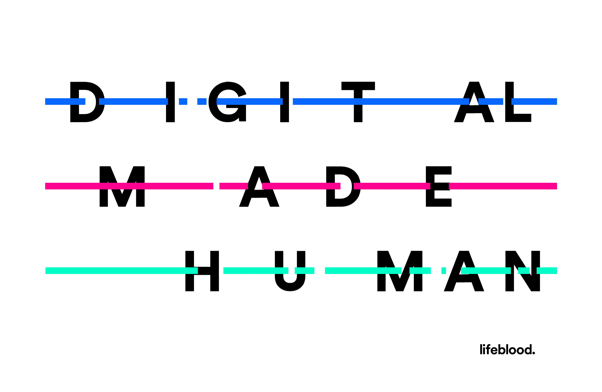

# Lecture 2

**Date:** Friday 24th Feb

### Recap from our previous lecture

**We discussed**

1. Platforms 
* Social Media
* Typography 
* Colors  

### In class we will discuss: 

1. Visual perceptions 
* Bio's (Be prepared to present your own for critique)
* More website examples
* Tutorials on your current progress

## Visual perceptions

###Proximity: 

things closer together will be seen as belonging together.

###Similarity: 

things with the same characteristics (shape, colour, shading, quality, orientation) will be seen as belonging together.

###Symmetry: 

our mind tends to perceive objects as developing around a centre point and it’s pleased when it can divide those objects evenly and find balance.

###Figure-Ground: 

a series of rules that tells our eyes what to focus on first, what is the shape and what is its background.

###“Common Fate”: 

objects are perceived as lines that move along the smoothest path. Elements moving in the same direction seem more related than elements that are stationary or that move in different directions.

###Continuity: 

the viewer’s eye will naturally follow the smoothest path.

###Closure: 

when parts of a whole picture are missing, our perception fills in the visual gap.

## Bio's 

1. Jazz yourself up 
* Think about your audience (Employers, clients etc) 
* Show some of your personality 
* Talk about your skills
* Touch on your achivments (Competitions etc) 

## More website exmaples

http://simonfosterdesign.com/home/

https://madebyjohannes.nl

http://wearecolossale.com

https://www.adamunderwear.com

https://designobjekt.se

http://www.stefanheinrichs.com/373

http://stemme.co.nz

http://lifebloodagency.com

## Tutorials on current progress

1. Is your website live? 
* Have you got 10 pieces of work the portfolio page? 
* Is your email working? 
* Have your written your 500 word bio? 
* Is your social media channels up to date and linked to on your website? 
 

### Deliverables for your formative 

1. 10 pieces of work from your most recent work on the portfolio page
* Website must be live
* Corresponding email that works 

**Sources**

1. https://manifesto.co.uk/design-principles-gestalt-white-space-perception/
* https://blog.freelancersunion.org/2014/06/10/5-tips-writing-an-un-sucky-bio-and-about-page/