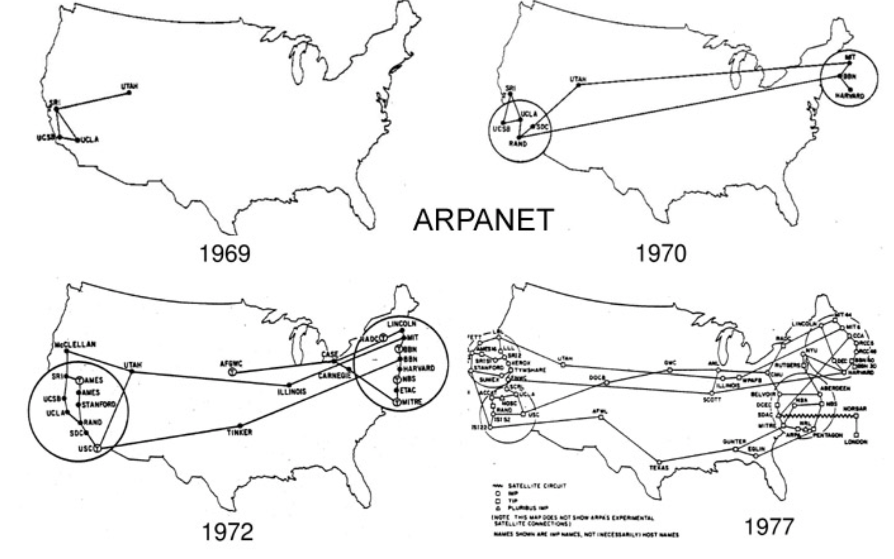

# Today, Monday 8th of January

* Welcome
* Before class
* Introduction to the brief
* The History of the Web
* Open Source
* Create mini-lessons in groups
* Present mini-lessons

## Welcome

> `Before class`

#### Bring in an item which symbols connectivity to you and explain why it does that in class.

### Introduction to the brief

The students will be divided into their usual groups of approximately four members and each group will review its investigative Project from the previous unit DMT15103, which related to a subject relevant to IP TV digital media distribution and was connected to some degree with their present work activities.

In this unit DMT15204’s group project activity, each Project group will produce a live webpage for a customer in their Project area; and each Project group member will work on a particular aspect of the customer’s requirements and implement its representation within the webpage. Each Project group will work together as a team, but the group will present contributions individually in a team format that they agree amongst themselves.

* Individual project (50%)
* Group project and website (50%)

> `Examples from 2015`

http://bt1.raveweb.net/

http://bt3.raveweb.net/

### The History of the Web

The internet and the web is not the same. What is the difference?

**The Internet is the infrastructure.**

The web is just one type of traffic using that infrastructure.  

The internet is a massive collection of millions of computers, all linked together on a computer network.

* The network allows all of the computers to communicate with one another.

### What is a protocol?

 > `Search the web and tell the class`

<!--
* A set of rules governing the exchange or transmission of
data between devices.
* Email (simple mail transfer protocol – SMTP)  •  BitTorrent (peer-to-peer file sharing protocol)  •  VoIP (Voice over Internet Protocol) Skype
* FTP (file transfer protocol)

**Internet Protocol:**
* Every machine on a network has a unique identifier.  
* Computers use the unique identifier to send data to
specific computers on a network.  

**Web protocol:**
* HTTP (Hyper Text Transfer Protocol - http://www.example.com)  
* HTML (Hyper Text Mark-up Language - interlinks hypertext documents   over the internet) -->

### What is ARPAnet?

> `Search the web and tell the class`

<!--
* Advanced Research Projects Agency Network (ARPAnet)
* Developed by the US Department of Defense between 1966-72
* Used interlinked nodes
* Cold war/nuclear attack myth.
* A way to enable researchers and scientists to share resources by accessing computers remotely (computers were still vast in size and expensive in cost).
* Developed ‘packet switching’ which enables data to split into
* smaller ‘packets’ of information..
* This made ‘packets’ of information easier to sent over a computer network.
* Packets of data could be routed around any part of the network that happened to be free, before getting reassembled at the other end. -->

### What is the first message ever sent over the internet?

> `Search the web and tell the class`

### Open Source

### Create mini-lessons in groups

* Show examples of some current web design trends
* What is DNS?
* What is HTTP?
* What is CSS?
* What is XML?

### Present mini-lessons

It's a form of **cooperative** learning, that is: learning from *each other, together*.

In peer learning, everybody plays both the **teacher** and the **learner**.

<!-- > Docendo discimus [By teaching, we learn] -->

By teaching to your peers, you reinforce your own learning. [It works](http://visible-learning.org/hattie-ranking-influences-effect-sizes-learning-achievement/hattie-ranking-teaching-effects)!

Also, you get to practice and build confidence in your **communication skills**.

At the end of your mini-lessons we'll give each other **feedback**. *Honest* feedback can hurt but it's through that (and practice) that we improve.
