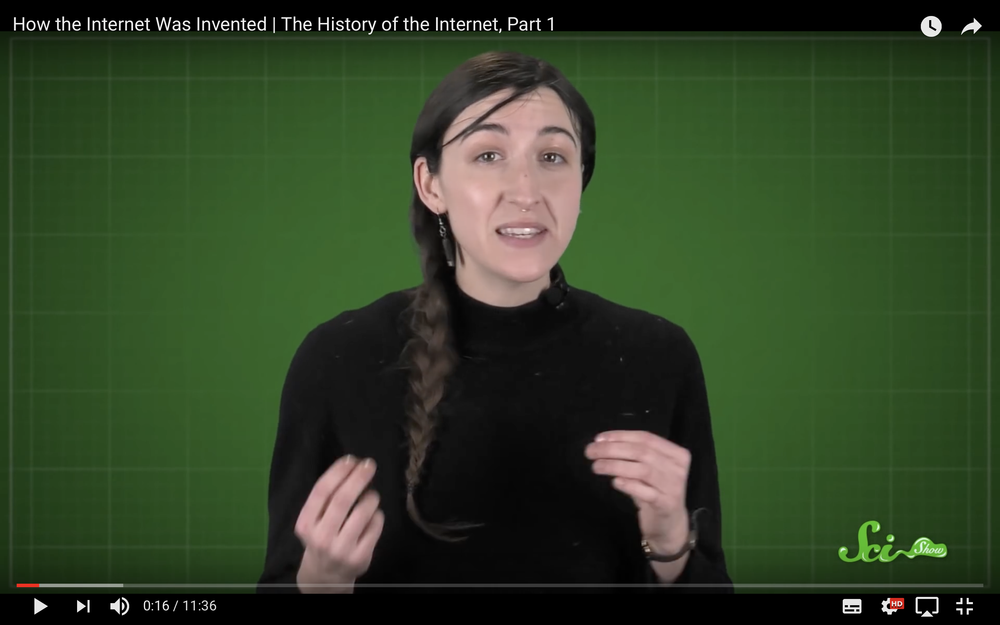

# Today, Monday 8th of January

* Welcome
* Introduction to the brief
* Quiz
* Create mini-lessons in groups
* Present mini-lessons

## Welcome

> `Before class you should have watched this film`

### Introduce yourself and the item that represents connectivity to you (15 min)

### Quiz time! (30 min)

1. When did the first computer come about?
<!-- Second world war -->

2. Who is the first physicist she mention and what did he do?
<!-- Richard Feyson -->

3. What was so revolutionary that university did in the 1950s-60s?

4. What is ARPA and APRANET?

5. What did Joseph Licklider do?

6. What is packet switching?

7. How many computers where connected in 1977?

8. What does TCP/IP stand for?

9. When was emailed invented?

10. What is DNS?

### Create mini-lessons (1,5 hour)

In small teams, you will research one web/internet concept or technique and prepare a **mini-lesson** (~15 minutes) to teach everyone else about it.

Make your presentation **interactive**!

It's a form of **cooperative** learning, that is: learning from *each other, together*.

In peer learning, everybody plays both the **teacher** and the **learner**.

<!-- > Docendo discimus [By teaching, we learn] -->

By teaching to your peers, you reinforce your own learning. [It works](http://visible-learning.org/hattie-ranking-influences-effect-sizes-learning-achievement/hattie-ranking-teaching-effects)!

Also, you get to practice and build confidence in your **communication skills**.

At the end of your mini-lessons we'll give each other **feedback**. *Honest* feedback can hurt but it's through that (and practice) that we improve.

### Topics!

Who | What
--- | -----------
Group 1 | What is Open Source?
Group 2 | What is HTML/CSS? Show examples!
Group 3 | What is a protocol?
Group 4 | Who is Tim-Berners Lee and what did he do?

### Present your mini-lesson! (1 hour)

## Let's give each other *honest* **feedback** (30 min)

#### Mini-lesson **content**   

1. How did you **plan** your mini-lesson?
* What were the **key points** you wanted to get across?
* How did you decide to communicate them?
* What **assumptions** have you made about what we already know?
* How **interactive** was your mini-lesson? How was the audience meant to *participate*?

#### **Delivery**

1. What role did each **team member** play in delivering the mini-lesson?
* How did you **practice** your mini-lesson?
* How did your mini-lesson start? How did you *hook* your audience?
* What was your **body language** like? Consider facial expressions, movements of the arms, eye contact with the audience, and posture.
* What was your **voice** like? Consider speed of delivery, pausing, volume and pitch
* Did you keep within the time?   

#### What can be **improved**?

### Introduction to the brief (1 hour)

The students will be divided into their usual groups of approximately four members and each group will review its investigative Project from the previous unit DMT15103, which related to a subject relevant to IP TV digital media distribution and was connected to some degree with their present work activities.

In this unit DMT15204’s group project activity, each Project group will produce a live webpage for a customer in their Project area; and each Project group member will work on a particular aspect of the customer’s requirements and implement its representation within the webpage. Each Project group will work together as a team, but the group will present contributions individually in a team format that they agree amongst themselves.

* Individual project (50%)
* Group project and website (50%)

> `Examples from 2015`

http://bt1.raveweb.net/

http://bt3.raveweb.net/
