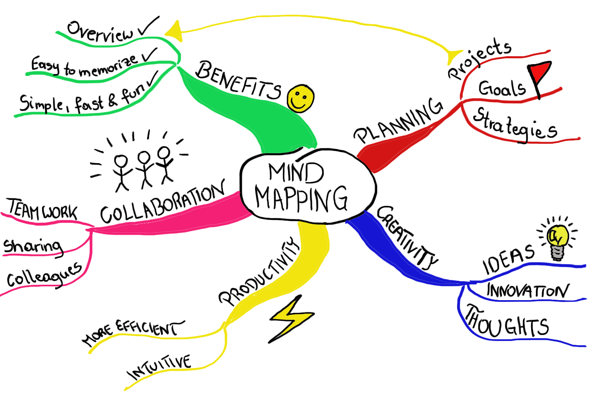

# Today, Thursday 11th of January

* Learning goals for today
* Quiz time!
* Let's talk about *content*
* Lets talk about Mood-boards!
* Lets talk about Wordpress!

### Learning goals for today
* A final investigation into the history of the internet
* Create a content map and start producing content
* Create mood-boards for your website
* Install Wordpress

### What do you remember from yesterday? Lets go through it together.

> Hot tip: Look at your mind-map from yesterday

## Discussion time!

1. How do you feel about privacy?

2. What kind of internet do you want to be a part of?

# Now, let's talk about *content*

When it comes to *content* you may hear designers (including myself) saying things like

> ... the client can do it

or

> ... the users will *generate* it

And yet, people (the vast majority of people) come to our websites **hungry for content**.

They don't care about our *parallax scrolling*, *animated SVG*, *jQuery plugins* or whatever is trendy among us.

They want to **find** information and **do** something with it.

#### Usable & useful content

This is not to say that we should bin all the subtle details that can make a site delightful to use, but rather that we should start talking about the *elephant in the room*.

## What is content then?

### Content is not *Lorem Ipsum*

`Lorem Ipsum` is gibberish that conveniently fills the available space like an expanding gas.

It is **meaningless** and **lacks context**, revealing nothing about the relationship between your design and your content.

By using `Lorem Ipsum` you are running the risk of actual, final content breaking your carefully pixel-pushed layout. What if real title are a bit longer than the conveniently cut `Lorem Ipsum` you filled your layout with? What if your client wants to have 3 paragraphs instead of 2?

#### Using *Lorem Ipsum* is a missed opportunity to do good design.

In this course `Lorem Ipsum` is banned. I warned you.

### Stock images are the visual equivalent of *Lorem Ipsum*

Using stock images is a missed opportunity to engage with **real content**.

Instead of using a beautifully irrelevant stock image, use an ugly yet relevant one. Make it clear that it's a placeholder.

Bad images can be useful to trigger a conversation and call for good content. As the [McDonald's theory](https://medium.com/@ienjoy/mcdonalds-theory-9216e1c9da7d) states: *people are inspired to come up with good ideas to ward off bad ones*.

### A quick experiment

1. Think about a website you visit/use regularly.
2. Now imagine it **without text**.
3. What would be left?

<!--

* empty boxes
* meaningless, decontextualised images

-->

### Content is mostly **text**

Text carries [95%](https://ia.net/know-how/the-web-is-all-about-typography-period) of your page's **meaning**, and gives **context** to your media (images, videos etc.)

You can capture people with (more or less moving) images but then you need text to:

* **communicate** precisely the message(s) you want to get across
* **persuade** people to take action

# Workshop

If all we said so far holds true, then as Web designers we should adopt a **content-first** approach. Start with content, and design our sites/apps/products etc around it.

Let's work on what your page actually *says*, aka **copywriting**.

### Copywriting is interface design

As [they say](https://gettingreal.37signals.com/ch09_Copywriting_is_Interface_Design.php)

> Do you label a button *Submit* or *Save* or *Update* or *New* or *Create*? That's copywriting.

> Icons with names, form fields with examples, buttons with labels, step by step instructions in a process, a clear explanation of your refund policy. These are all interface design.

By the way, [*copywriting*](http://dictionary.reference.com/browse/copywriting) is not the same as [*copyright*](http://dictionary.reference.com/browse/copyright).

### Your turn

1. Open [this GDoc](https://docs.google.com/document/d/12k6g32253ngZzHVAZTWJvgGxB73UiamsronQoGbvYy8/edit?usp=sharing) and `File` > `Make a copy...`
* Rename your copy by adding your first name at the beginning, eg `Billie - Content strategy`.
* Change the sharing settings for your document so that `Anyone with the link can comment`.

	
* Share the link to your document with us on Slack.
* Write about your page **target audience(s)**, their motivations, pain points, goals and language.
* With your audience(s) in mind, **flesh out** all the copy of your page.
* We'll **test** your first draft (read out loud) between us.
* **Edit** your draft: remove the bits that are not so important, and tweak the other bits to sound like what your audience(s) may want to read.

Here's an [example content strategy document](https://docs.google.com/document/d/1XyaSoEvu0MraH7cqeEKLMbTc1cAP-B184tB6Usx5UsM/edit?usp=sharing) I co-wrote *before* designing a [one-pager](https://codeyourapp.club) for a coding course I run.

Taking a **content-first** approach for that project has been extremely useful, allowing us to clearly identify **who** we were writing for. With the **who** in mind, planning the content and designing the site became much easier. And it lead to a very successful recruitment drive: +285% booking!

### Workshop: Moodboard

*As a team*: create a **mood-board** for your website design.

* Use [Pinterest](https://www.pinterest.com) to assemble all your inspirations and ideas
* Include at least 3 websites that you consider *worth copying* (and explain in the comments what you're going to *steal* from them and why)
* Post screenshots of both macro-views (entire pages) as well as micro-views (details)
* You can also post your own sketches, photos or any other material that can help you and us understand and talk about which direction your design is moving towards

There are tons of [moodboards on Pinterests tagges as *webdesign*](https://www.pinterest.com/search/boards/?q=webdesign).

Also, check out [SiteInspire](http://www.siteinspire.com) and [Panda](https://usepanda.com)!

### Workshop: Wordpress install & theme

* Lets install Wordpress
* Find a suitable theme

Here you can [find slide deck inspiration](https://slidebean.com/presentation-templates/) 

### Workshop (45 min)

Create a mind-map of your learning today. We will walk around the classroom inspecting each others mind-map and give each other feedback with post-its.

### Homework

[Watch this film on graphic design fundamentals theory](https://www.youtube.com/watch?v=YqQx75OPRa0)
