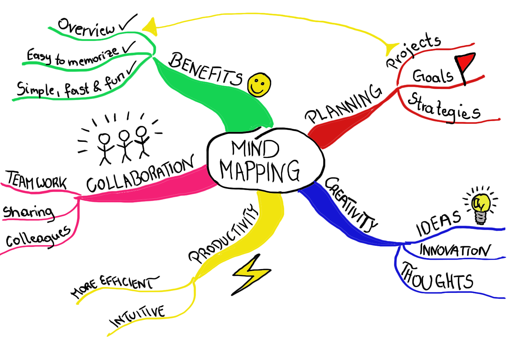

# Today, Thursday 11th of January

* What do you remember from yesterday?
* What was your biggest learning from the video?
* Lets install Wordpress!
* Find a Wordpress theme to use for this project
* Tutorials

### What was your biggest learning and why?

### Lets install Wordpress

> I will take you through the process and the basics

### Find a free Wordpress theme that fits your project and install it

> You can find free themes by googling it!

### Create branding material such as logos and imagery

> Use your user persona to think about what colours, shapes and typography they might respond well to. 

### Workshop (45 min)

Create a mind-map of your learning today. We will walk around the classroom inspecting each others mind-map and give each other feedback with post-its.

### Homework

[Watch part 3 of the History of the web](https://www.youtube.com/watch?v=eYkXD_cGUYU) and be prepared to be quizzed tomorrow!
